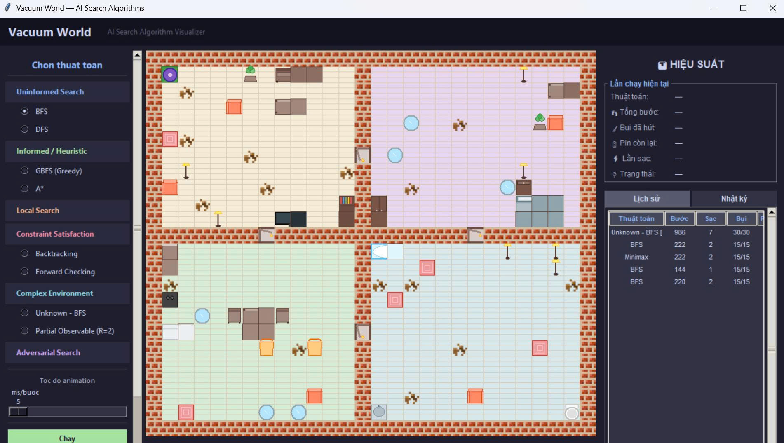

  
# Vacuum World AI

Vacuum World AI là một dự án mô phỏng bài toán **Vacuum World** trong Trí tuệ nhân tạo (Artificial Intelligence). Chương trình được xây dựng bằng Python nhằm minh họa cách các tác tử thông minh (Intelligent Agents) hoạt động trong một môi trường có chứa bụi bẩn, sử dụng nhiều nhóm thuật toán AI để tìm lời giải tối ưu hoặc gần tối ưu.

---

# Giới thiệu

Vacuum World là một trong những bài toán nền tảng của Trí tuệ nhân tạo, thường được sử dụng để nghiên cứu:

- Intelligent Agents
- State Space Search
- Search Algorithms
- Path Planning
- Decision Making
- Constraint Satisfaction
- Adversarial Search
- Local Search

Trong dự án này, robot hút bụi sẽ quan sát môi trường, lập kế hoạch di chuyển và làm sạch toàn bộ các ô chứa bụi theo chiến lược của từng thuật toán.

---

# Tính năng

- Giao diện trực quan bằng Python.
- Mô phỏng môi trường Vacuum World.
- Hiển thị quá trình robot di chuyển.
- So sánh nhiều thuật toán AI.
- Quan sát đường đi của robot.
- Theo dõi hiệu quả của từng thuật toán.
- Dễ dàng mở rộng thêm thuật toán mới.

---

# Cấu trúc dự án

```
vacuum/
│
├── vacuum_world/
│   ├── algorithms/
│   │   ├── uninformed/
│   │   ├── informed/
│   │   ├── local_search/
│   │   ├── adversarial/
│   │   ├── complex_environment/
│   │   ├── csp/
│   │   ├── base.py
│   │   └── pathfinder.py
│   │
│   ├── ui/
│   ├── models/
│   ├── utils/
│   ├── main.py
│   └── ...
│
└── README.md
```

---

# Các nhóm thuật toán

## Uninformed Search

- Breadth First Search (BFS)
- Depth First Search (DFS)

---

## Informed Search

- Greedy Best First Search (GBFS)
- A* Search

---

## Local Search

- Hill Climbing
- Simulated Annealing

---

## Adversarial Search

- Minimax
- Alpha-Beta Pruning

---

## Complex Environment

- Unknown Environment BFS
- Partial Observable Search

---

## Constraint Satisfaction Problem (CSP)

- Backtracking Search
- Forward Checking

---

# Công nghệ sử dụng

- Python 3
- Tkinter (Giao diện)
- Object-Oriented Programming (OOP)

Các thư viện chuẩn được sử dụng bao gồm:

```
tkinter
collections
heapq
random
math
copy
queue
threading
```

---

# Cài đặt

Clone repository

```bash
git clone https://github.com/thangdanglk-ui/Vacuum.git
```

Di chuyển vào thư mục dự án

```bash
cd vacuum
```

---

# Chạy chương trình

```bash
python main.py
```

hoặc chạy file khởi động tương ứng nếu dự án sử dụng cấu trúc khác.

---

# Mô hình môi trường

Robot hoạt động trên một lưới hai chiều.

Mỗi ô có thể thuộc một trong các trạng thái:

- Ô sạch
- Ô bẩn
- Ô chướng ngại vật (nếu có)
- Vị trí hiện tại của robot

Robot sẽ:

- Quan sát môi trường.
- Lập kế hoạch.
- Di chuyển.
- Hút bụi.
- Dừng khi toàn bộ môi trường đã sạch hoặc đạt điều kiện kết thúc.

---

# Kiến thức AI được minh họa

Dự án giúp minh họa các chủ đề:

- Intelligent Agent
- State Representation
- State Space Search
- Graph Search
- Tree Search
- Heuristic Search
- Local Search
- Constraint Satisfaction Problem
- Adversarial Search
- Partial Observable Environment
- Unknown Environment
- Path Planning

---

# Mục đích học tập

Dự án được xây dựng nhằm:

- Hỗ trợ học tập môn Trí tuệ nhân tạo.
- Minh họa trực quan hoạt động của các thuật toán tìm kiếm.
- So sánh hiệu quả giữa các thuật toán.
- Làm tài liệu tham khảo cho sinh viên và người nghiên cứu AI cơ bản.

---
